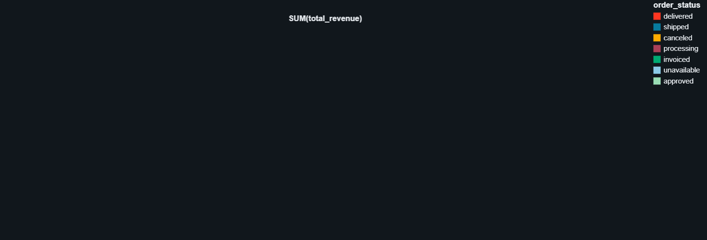
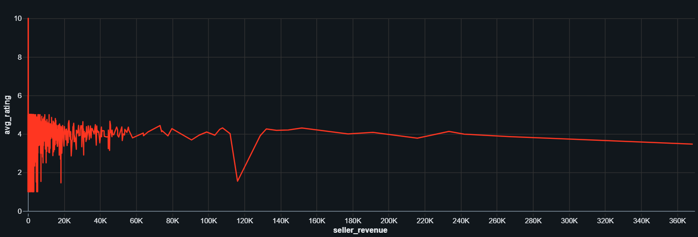

## End-to-End Azure Data Pipeline with Medallion Architecture

This project shows how I built a simple end-to-end data pipeline on Microsoft Azure using the Medallion architecture (Bronze → Silver → Gold). It uses Azure Data Factory (ADF), Azure Data Lake Storage (ADLS), Azure Databricks, and Azure Synapse Analytics.

The dataset is the Olist e‑commerce data (CSV files). We load raw CSVs to the lake (Bronze), clean and join them (Silver), and create final business tables (Gold) for reporting.

### What you will learn
- **How data moves** from source (GitHub/SQL) to ADLS using ADF
- **How transformations** run in Databricks (Bronze → Silver → Gold)
- **How to query** final data using Synapse

## Architecture (Medallion)
- **Bronze**: Raw files as‑is in ADLS
- **Silver**: Cleaned and standardized tables
- **Gold**: Aggregated, business-ready tables (for dashboards)

Check `DOCS/Project Architecture.jpg` for the visual diagram.

Mermaid diagram (viewable on GitHub):

```mermaid
flowchart LR
  subgraph Sources
    GH[GitHub CSVs]
    SQL[(SQL DB)]
  end

  ADF[Azure Data Factory\nPipelines + Datasets]
  ADLS_B[ADLS Gen2\nBronze (Raw)]
  DB_S[Azure Databricks\nSilver (Cleaned)]
  DB_G[Azure Databricks\nGold (Aggregated)]
  SYN[Azure Synapse\n(SQL/Serverless)]
  PBI[Power BI / Dashboards]

  GH --> ADF
  SQL --> ADF
  ADF --> ADLS_B
  ADLS_B --> DB_S
  DB_S --> DB_G
  DB_G --> SYN
  DB_G --> PBI

  classDef storage fill:#dff0ff,stroke:#0078d4,color:#003a6d;
  classDef compute fill:#fff4ce,stroke:#8a6d3b,color:#5c4400;
  classDef service fill:#e5f5e5,stroke:#2f855a,color:#22543d;

  class ADLS_B storage;
  class DB_S,DB_G compute;
  class ADF,SYN,PBI service;
```

## Components in this repo
- `ADF/` – ADF pipelines, datasets, and linked services in JSON
- `DataBricks/` – PySpark scripts for Silver and Gold layers
- `DOCS/` – Architecture and sample charts
- CSV files – Olist datasets used as source
- `SQLSynapsePath.json` – Example path settings for Synapse
- `Table_form_local_to_DB_Filess.ipynb` – Local to DB upload notebook (optional)

## Prerequisites
- Azure subscription
- Azure resources: ADLS Gen2, ADF, Databricks workspace, (optional) Synapse
- Permissions to create linked services, access storage, and run clusters

## Setup (one-time)
1. Create an ADLS Gen2 storage account. Note the container name (for example, `olist`).
2. Create an ADF instance.
3. Create a Databricks workspace and a small cluster (e.g., 7.3+ ML or latest runtime that supports PySpark).
4. (Optional) Create a Synapse workspace and a serverless SQL endpoint or dedicated SQL pool.

## Load data to Bronze (ADF)
1. In ADF, import the JSON files in `ADF/`:
   - `linkedService/` (connect to ADLS, GitHub/HTTP, SQL, etc.)
   - `dataset/` (CSV/JSON dataset definitions)
   - `pipeline/DataProcessingPipeLine.json`
2. Set the connection secrets (keys, connection strings) in linked services.
3. Upload Olist CSVs from this repo to ADLS (or let ADF copy them from GitHub to ADLS).
4. Run the pipeline to place raw files in the Bronze folder.

Folder suggestion in ADLS:
- `adlspath/bronze/...` raw CSVs
- `adlspath/silver/...`
- `adlspath/gold/...`

## Transform to Silver and Gold (Databricks)
1. Open Databricks and create a new repo or workspace folder.
2. Upload scripts from `DataBricks/`:
   - `Olist Data Processing - SILVER.py`
   - `Olist Data Processing - GOLD.py`
3. Edit the storage paths in the scripts so they point to your ADLS container and folders.
4. Run the Silver script first (reads Bronze, cleans, writes Silver).
5. Run the Gold script next (reads Silver, aggregates, writes Gold).

## Query in Synapse (optional)
1. Point Synapse to the Gold folder (use `SQLSynapsePath.json` as a reference).
2. Create external tables or use OPENROWSET to query Gold data.
3. Build dashboards in Power BI or Synapse Studio if you want.

## Project structure (quick view)
- `ADF/` – factory, linkedService, dataset, pipeline JSONs
- `DataBricks/` – PySpark for Silver/Gold
- `DOCS/` – images and charts
- `*.csv` – Olist source data

## Notes and tips
- Keep storage paths consistent across ADF and Databricks.
- If a job fails, check the service (ADF run logs, Databricks job output).
- Start small (few files), then scale to the full dataset.

## Why this matters
This pipeline is simple, but it follows real industry patterns: clear layers, reproducible runs, and tools that work well together. It can be a base for larger production systems.

## Sample visuals (from Gold data)





